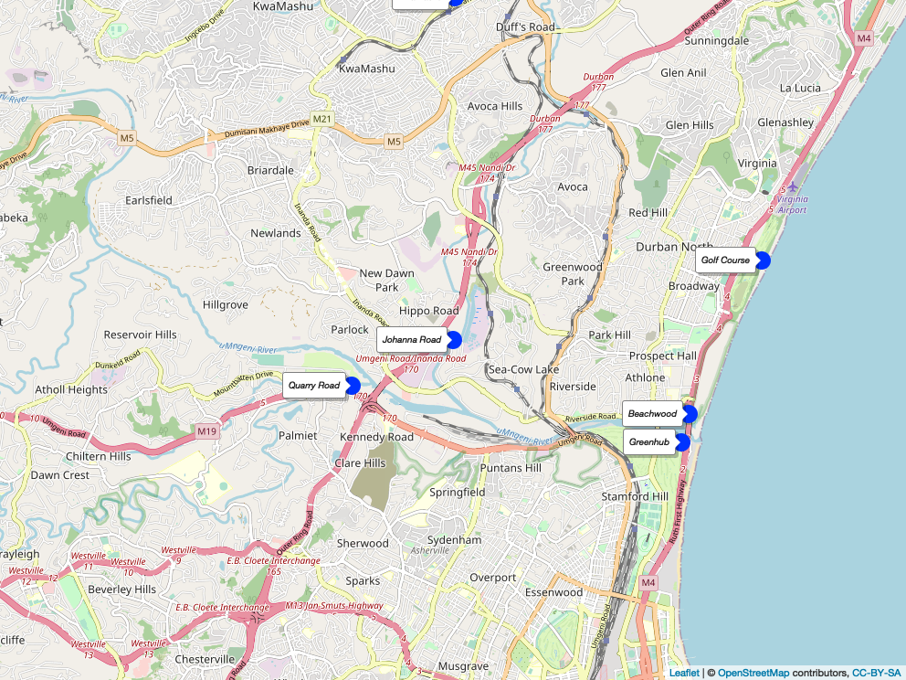
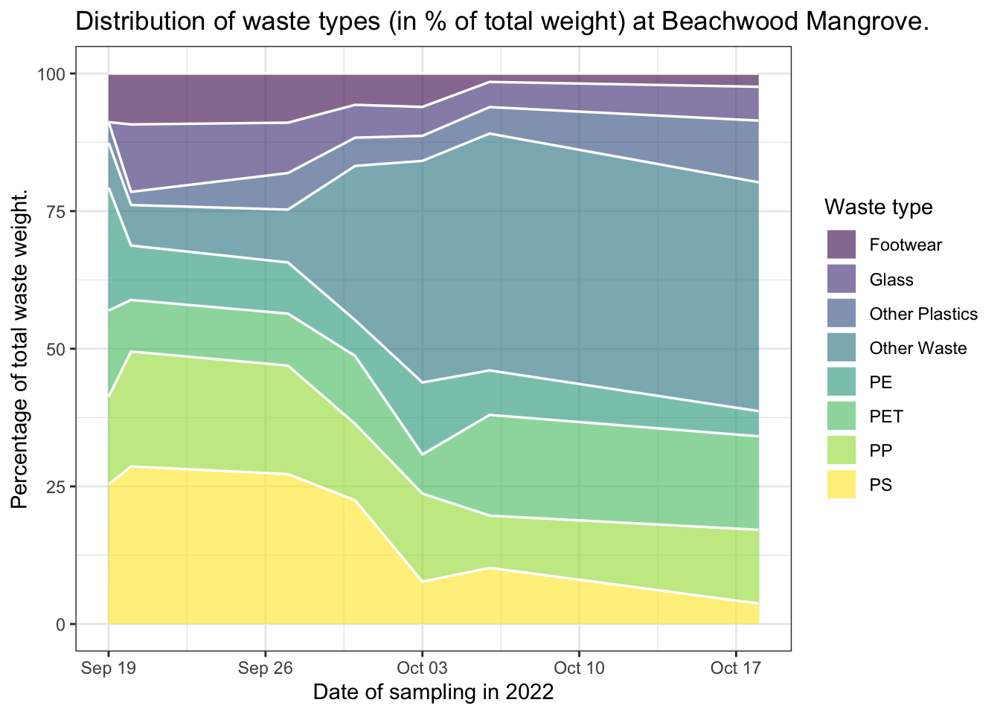

<!-- README.md is generated from README.Rmd. Please edit that file -->

# durbanplasticwaste

<!-- badges: start -->

[](https://zenodo.org/badge/latestdoi/604573987)
[](https://github.com/Global-Health-Engineering/durbanplasticwaste/actions/workflows/R-CMD-check.yaml)

<!-- badges: end -->

# Overview

This packages combines data collected as part of an MSc. Thesis Project
and an MSc. Semester Project conducted in Durban, South Africa. The
projects were supported by the Global Health Engineering group at ETH
Zurich, Switzerland.

# Installation

You can install the development version of durbanplasticwaste from
[GitHub](https://github.com/) with:

``` r
# install.packages("devtools")
devtools::install_github("Global-Health-Engineering/durbanplasticwaste")
```

Alternatively, you can download the individual datasets as a CSV or XLSX
file from the table below.

| dataset            | CSV                                                                                                                          | XLSX                                                                                                                           |
|:-------------------|:-----------------------------------------------------------------------------------------------------------------------------|:-------------------------------------------------------------------------------------------------------------------------------|
| litterboom_counts  | [Download CSV](https://github.com/Global-Health-Engineering/durbanplasticwaste/raw/main/inst/extdata/litterboom_counts.csv)  | [Download XLSX](https://github.com/Global-Health-Engineering/durbanplasticwaste/raw/main/inst/extdata/litterboom_counts.xlsx)  |
| litterboom_weights | [Download CSV](https://github.com/Global-Health-Engineering/durbanplasticwaste/raw/main/inst/extdata/litterboom_weights.csv) | [Download XLSX](https://github.com/Global-Health-Engineering/durbanplasticwaste/raw/main/inst/extdata/litterboom_weights.xlsx) |
| locations          | [Download CSV](https://github.com/Global-Health-Engineering/durbanplasticwaste/raw/main/inst/extdata/locations.csv)          | [Download XLSX](https://github.com/Global-Health-Engineering/durbanplasticwaste/raw/main/inst/extdata/locations.xlsx)          |
| plastic_types      | [Download CSV](https://github.com/Global-Health-Engineering/durbanplasticwaste/raw/main/inst/extdata/plastic_types.csv)      | [Download XLSX](https://github.com/Global-Health-Engineering/durbanplasticwaste/raw/main/inst/extdata/plastic_types.xlsx)      |

# Projects

## MSc. Thesis Project

Evaluating the potential of Extended Producer Responsibility returns for
a small local waste collection company through a brand audit of riverine
plastic waste in Durban, South Africa.

### Description

This Master’s Thesis Project focuses on determining the growth
opportunities for a small-sized plastic recycling enterprise in light of
the shift from a voluntary to a mandatory Extended Producer
Responsibility (EPR) policy in South Africa.

To achieve this goal in the context of a small start-up in Durban, South
Africa , a brand audit is conducted to identify the top brands that can
be targeted for financing or partnership opportunities. The company,
called [TRI ECO Tours](https://triecotours.co.za/), is a small tourism
and waste collection startup in Durban operated by Siphiwe Rakgabale.

### Research Question

What is the characterization by type, application, and brand of plastic
waste collected in the uMngeni River system in Durban, South Africa?

### Data

The data was collected throughout two months in Durban, South Africa
right before the rainy season. The collection took place in 6 different
litterboom locations throughout Durban. The data gathered was the audit
of the occurence of the brands washed into the litterbooms.

The package provides access to three data sets.

``` r
library(durbanplasticwaste)
```

The `litterboom_counts` data set has 7 variables and 2784 observations.
For an overview of the variable names, see the following table.

``` r
litterboom_counts
```

| variable_name | variable_type | description                                                                                                                    |
|:--------------|:--------------|:-------------------------------------------------------------------------------------------------------------------------------|
| date          | date          | Date of the collected litterboom sample.                                                                                       |
| location      | character     | Descriptive name of the sample location. See \[`locations`\] for longitude and latitude.                                       |
| brand         | character     | Brand name of the collected item (e.g. Coca Cola).                                                                             |
| group         | character     | Group name that owns the brand (e.g. Coca Cola Beverages South Africa).                                                        |
| plastic       | character     | Type of plastic of the item (identified plastic types are PET; HDPE; and PP. HDPE and PP were categorised together as HDPE/PP. |
| category      | character     | Categorisation of waste into 15 product type categories (e.g. Alcohol; Milk; Tobacco; Water).                                  |
| count         | numeric       | Number of counted items.                                                                                                       |

The `litterboom_weights` data set has 4 variables and 14 observations.
For an overview of the variable names, see the following table.

| variable_name | variable_type | description                              |
|:--------------|:--------------|:-----------------------------------------|
| date          | date          | Date of the collected litterboom sample. |
| location      | character     | Descriptive name of the sample location. |
| pet           | numeric       | Weight (in kg) of PET items.             |
| hpde_pp       | numeric       | Weight (in kg) of PET items.             |

The `locations` data set has 3 variables and 6 observations. For an
overview of the variable names, see the following table.

| variable_name | variable_type | description                              |
|:--------------|:--------------|:-----------------------------------------|
| location      | character     | Descriptive name of the sample location. |
| latitude      | numeric       | Latitude coordinate.                     |
| longitude     | numeric       | Longitude coordinate.                    |

Locations data as a map illustrating the six litterboom sampling
locations in Durban, South Africa. For an interactive map and other code
examples, see `vignette("examples")`.



## MSc. Semester Project

Examination of non-recycled marine plastic litter in order to identify
recycling and beneficiation pathways in Durban, South Africa

### Description

This Semester Thesis Project focuses on determining the distribution of
plastic litter on the Durban beachfront in order to identify key targets
for policy and financial support through the South African EPR policy to
reduce plastic spills into the environment and promote higher recycling
rates.

Research Question

What types and amounts of plastic are found along the beachfront in the
mangroves of Durban-North, South Africa?

### Data

The data was collected in collaboration with a local team that provided
the waste for the study. Two different approaches were used to clean up
the waste. One to collect the waste floating on the river, preventing it
from reaching the sea and one to collect waste washed ashore at the
beaches. Three locations along the rivers close to settlements and one
at the beach in Durban North.

The package provides access to one data set of this project.

``` r
library(durbanplasticwaste)
```

The `plastic_types` data set has 16 variables and 13 observations. 11
observations were made on the beach which were added together in the row
that has “Beach Total” as the value for the variable “place”. One
observation was done at a litterboom. For an overview of the variable
names, see the following table.

``` r
plastic_types
```

| variable_name  | variable_type | description                                                                                                                                                                                                        |
|:---------------|:--------------|:-------------------------------------------------------------------------------------------------------------------------------------------------------------------------------------------------------------------|
| date           | date          | Collection date of the data.                                                                                                                                                                                       |
| place          | character     | Place where the collection was done.                                                                                                                                                                               |
| total          | double        | Total amount of waste chategorized in kg.                                                                                                                                                                          |
| pet            | double        | Amount of polyethylene terephthalate (PET) in kg.                                                                                                                                                                  |
| pe             | double        | Amount of polyethylene (PE) in kg. During the sorting process HDPE and LDPE plastics were not distinguished.                                                                                                       |
| pp             | double        | Amount of polypropylene (PP) in kg.                                                                                                                                                                                |
| ps             | double        | Amount of polystyrene (PS) in kg.                                                                                                                                                                                  |
| hdpe_pp        | double        | Amount of high-density polyethylene (HDPE) and polypropylene (PP) combined weight in kg. During the sorting process these two plastics were not distinguished.                                                     |
| other_plastics | double        | Amount of other plastics in kg. The category ‘Other plastics’ included plastics that couldn’t be identified by the scanner or plastics that are in such small amounts the weighing scale could not distinguish it. |
| other_waste    | double        | Amount of other waste in kg remaining at the end of the categorization.                                                                                                                                            |
| glass          | double        | Amount of glass in kg.                                                                                                                                                                                             |
| shoes          | double        | Amount of shoes in kg.                                                                                                                                                                                             |
| shoes_quantity | double        | Number of shoes found at the location. Surprisingly a lot of shoes were found. As they often consisted of a combination of different plastics then a separate category was made for shoes.                         |
| bag_quantity   | double        | Number of bags that where collected.                                                                                                                                                                               |
| beach          | logical       | Categorical variable showing whether the collection was done at the beach (TRUE) or at the a litterboom (FALSE).                                                                                                   |
| details        | character     | Additional information about the sampled data.                                                                                                                                                                     |

The following plot is showing the distribution of the waste weight for
different plastic and waste types at the Beachwood Mangrove across the
sampling period (September 19th 2022 - October 17th 2022) in percent.



## Examples

The `litterboom_counts` data identifies 40 unique groups that own the
identified brands. The top 10 brands are shown in the following table.
All other brands are lumped together as OTHER.

``` r
library(durbanplasticwaste)
library(dplyr)
library(forcats)

litterboom_counts |> 
  mutate(group = factor(group)) |> 
  mutate(group = fct_lump(group, n = 10, other_level = "OTHER")) |> 
  group_by(group) |> 
  summarise(
    count = sum(count)
  ) |> 
  arrange(desc(count)) |> 
  mutate(percent = count / sum(count) * 100) |> 
  knitr::kable(digits = 0)
```

| group                            | count | percent |
|:---------------------------------|------:|--------:|
| OTHER                            |  8086 |      52 |
| Coca Cola Beverages South Africa |  4030 |      26 |
| unidentifiable                   |  1202 |       8 |
| Clover Industries LTD            |   737 |       5 |
| Unilever                         |   442 |       3 |
| Tiger Brands                     |   232 |       2 |
| danone                           |   183 |       1 |
| Siqolo Foods                     |   144 |       1 |
| Willowton Group                  |   139 |       1 |
| Amka Products                    |   132 |       1 |
| RCL Foods                        |    95 |       1 |

## License

Data are available as
[CC-BY](https://github.com/Global-Health-Engineering/durbanplasticwaste/blob/main/LICENSE.md).

## Citation

To cite this package, please use:

``` r
citation("durbanplasticwaste")
#> Um Paket 'durbanplasticwaste' in Publikationen zu zitieren, nutzen Sie
#> bitte:
#> 
#>   Bergen R, Schöbitz L, Meyer-Piening C, Boynton L, Tilley E, Kalina M,
#>   Rakgabale S, Luvuno S, Loos S (2023). "durbanplasticwaste. Durban
#>   (South Aftica) Plastic Waste Data." doi:10.5281/zenodo.7845779
#>   <https://doi.org/10.5281/zenodo.7845779>,
#>   <https://global-health-engineering.github.io/durbanplasticwaste/>.
#> 
#> Ein BibTeX-Eintrag für LaTeX-Benutzer ist
#> 
#>   @Misc{R-durbanplasticwaste,
#>     title = {durbanplasticwaste. Durban (South Aftica) Plastic Waste Data},
#>     author = {Raúl Bergen and Lars Schöbitz and Chiara Meyer-Piening and Lin Boynton and Elizabeth Tilley and Marc Kalina and Siphiwe Rakgabale and Sfiso Nduduzo Luvuno and Sebastian Camilo Loos},
#>     doi = {10.5281/zenodo.7845779},
#>     url = {https://global-health-engineering.github.io/durbanplasticwaste/},
#>     abstract = {Waste characterisation data for extended producer responsibility.
#> The plastic waste was collected in the uMngeni River system in Durban,
#> South Africa, and categorised by brand, corporate group, application, and
#> type of plastic.},
#>     version = {0.1.1},
#>     year = {2023},
#>   }
```
